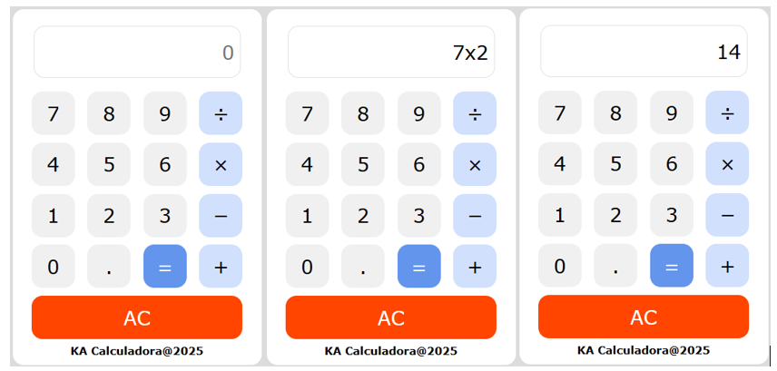

# Calculadora Simples

 

Calculadora: [Acesse o aplicativo aqui](https://katarine-albuquerque.rf.gd/calculadora/index.html)

### I. Sobre o projeto

* Realiza operações básicas: soma, subtração, multiplicação e divisão.

* Utiliza JavaScript para processar os cálculos em tempo real.

* Interface construída com HTML e CSS, garantindo usabilidade e visual limpo.

* Com eventos, funções e manipulação de dados no front-end.

### II. Contatos

* E-mail: [kba.2879@gmail.com](mailTo:kba.2879@gmail.com)

* Linkedin: [/katarine-albuquerque](https://www.linkedin.com/in/katarine-albuquerque/)
