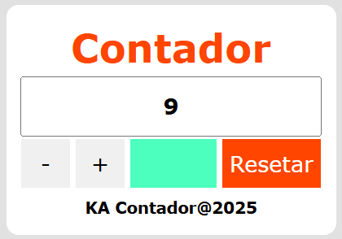
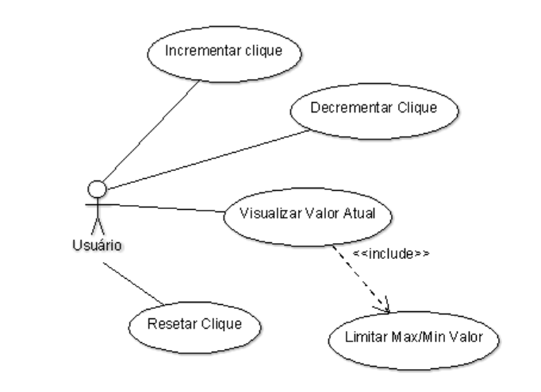

# Contador de cliques

 

Contador de cliques: [Acesse o aplicativo aqui](https://katarine-albuquerque.rf.gd/contador-de-cliques/index.html)

### I. Sobre o projeto

* Registra o número de vezes que um botão é clicado pelo usuário.

* Utiliza JavaScript para atualizar dinamicamente o valor exibido na tela.

* Inclui funções de reset e limite máximo de 10 cliques.

* Cada numeral apresenta uma cor.

* Uso de eventos, manipulação do DOM e variáveis.

### II. Diagrama de Caso de Uso

### III. Contatos

* E-mail: [kba.2879@gmail.com](mailTo:kba.2879@gmail.com)

* Linkedin: [/katarine-albuquerque](https://www.linkedin.com/in/katarine-albuquerque/)
