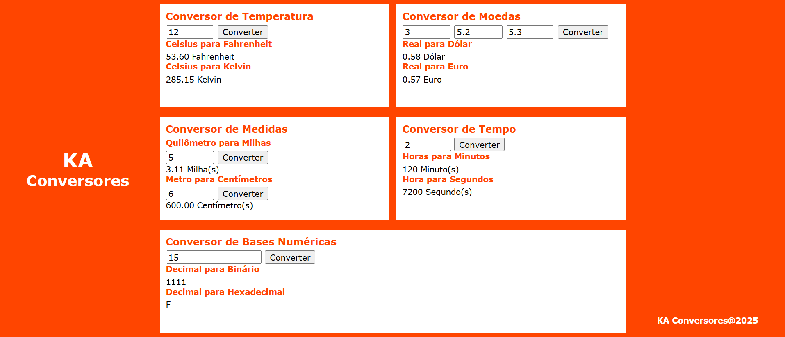

# Conversores

 

Conversores: [Acesse o aplicativo aqui](http://www.exemplo.com)

### I. Sobre o projeto

* Realiza conversões automáticas entre unidades como temperatura, moeda, tempo, medida e base numérica.

* Permite ao usuário inserir valores e obter resultados instantâneos em diferentes formatos.

* Utiliza JavaScript para cálculos e atualização dinâmica dos resultados na interface.

* Organiza os conversores em categorias visuais, facilitando a navegação e usabilidade.

### II. Contatos

* E-mail: [kba.2879@gmail.com](mailTo:kba.2879@gmail.com)
* Linkedin: [/katarine-albuquerque](https://www.linkedin.com/in/katarine-albuquerque/)