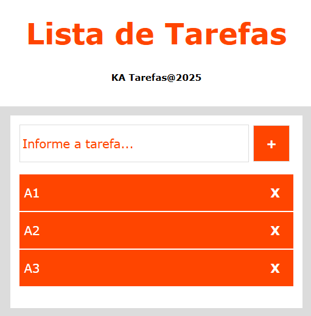

# Lista de Tarefas

 

Lista de Tarefas: [Acesse o aplicativo aqui]([http://www.exemplo.com](https://katarine-albuquerque.rf.gd/lista-de-tarefas/index.html))

### I. Sobre o projeto

* Permite adicionar tarefas manualmente por meio de um campo de texto e botão.

* Exibe as tarefas em uma lista organizada, com opção de exclusão individual.

* Utiliza JavaScript para manipular elementos dinamicamente na interface.

* Usa eventos, arrays e interação com o DOM.

### II. Contatos

* E-mail: [kba.2879@gmail.com](mailTo:kba.2879@gmail.com)

* Linkedin: [/katarine-albuquerque](https://www.linkedin.com/in/katarine-albuquerque/)
