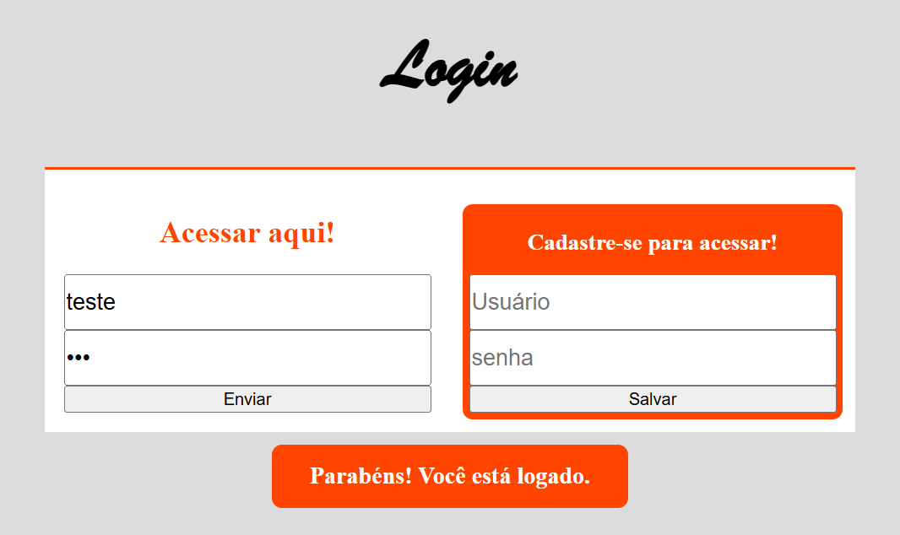

# Tela de Login

 

Tela de Login: [Acesse o aplicativo aqui](https://katarine-albuquerque.rf.gd/login/index.html)

### I. Sobre o projeto

- Cadastro de Usuário: Adiciona novos usuários com login e senha a uma lista temporária (dados), exibindo uma mensagem de sucesso ou erro.

- Login de Usuário: Verifica se o login e a senha inseridos correspondem a algum usuário cadastrado na lista.

- Validação de Campos: Garante que os campos estejam preenchidos antes de cadastrar ou autenticar.

- Exibição de Mensagens: Mostra mensagens dinâmicas na tela para informar o resultado das ações.

### II. Contatos

* E-mail: [kba.2879@gmail.com](mailTo:kba.2879@gmail.com)

* Linkedin: [/katarine-albuquerque](https://www.linkedin.com/in/katarine-albuquerque/)

