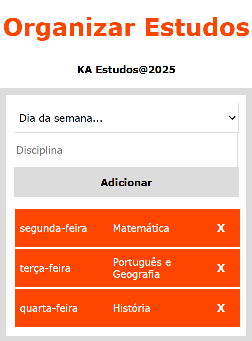
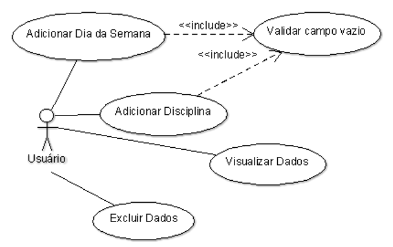

# Organizar Estudos

 

Organizar Estudos: [Acesse o aplicativo aqui](https://katarine-albuquerque.rf.gd/organizar-estudos/index.html)

### I. Sobre o projeto

* Permite agendar disciplinas associadas a dias da semana.

* Utiliza JavaScript para adicionar e remover itens dinamicamente.

* Facilita o planejamento de rotina de estudos de forma visual e prática.

* Manipulação de listas e eventos no front-end.

### II. Diagrama de Caso de Uso

### III. Contatos

* E-mail: [kba.2879@gmail.com](mailTo:kba.2879@gmail.com)

* Linkedin: [/katarine-albuquerque](https://www.linkedin.com/in/katarine-albuquerque/)

